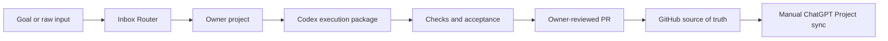

# AI-OS

[](https://github.com/sergstack/AI-OS/actions/workflows/docs-safety.yml)

AI-OS is a governed operating system for ChatGPT project routing, Codex
execution, analytical and LLM workflows, and Stream Deck controls. GitHub is
the live source of truth; ChatGPT Project Knowledge is a compact baseline for
bootstrapping and formal sync.

> [!IMPORTANT]
> This repository is not production-authorized and has no open-source license.
> See [Current Status](CURRENT_STATUS.md) and [Rights Posture](docs/rights_posture.md).

## How it works



Goal Mode is the default user-facing workflow. A broad goal is enough: the
responsible project should infer a bounded route, scope, checks, rollback, and
acceptance criteria. Strict task packages remain available for high-risk,
already-scoped, or explicitly requested work.

## Repository map

| Area | Purpose |
|---|---|
| [`ChatGPT/[Inbox Router]`](ChatGPT/%5BInbox%20Router%5D) | Turns raw or mixed input into a bounded destination or handoff. |
| [`ChatGPT/[AI OS]`](ChatGPT/%5BAI%20OS%5D) | AI evidence, supported patterns, confidence, and governance. |
| [`ChatGPT/[Thinking]`](ChatGPT/%5BThinking%5D) | Strategy, decisions, options, scenarios, risks, Judge, and Revisor work. |
| [`ChatGPT/[Analytics]`](ChatGPT/%5BAnalytics%5D) | Deterministic analysis, metrics, reconciliation, and analytical QA. |
| [`ChatGPT/[LLM]`](ChatGPT/%5BLLM%5D) | Prompts, model routing, LLM workflows, and model-quality gates. |
| [`ChatGPT/[Codex]`](ChatGPT/%5BCodex%5D) | Repository implementation framing, tests, and release handoffs. |
| [`ChatGPT/[Thinkers OS]`](ChatGPT/%5BThinkers%20OS%5D) | Thinker corpus, provenance, source intake, and synthesis maintenance. |
| [`Codex APP`](Codex%20APP) | Long-running repository execution and local run contracts. |
| [`StreamDeck`](StreamDeck) | Candidate dual-deck command surface, exports, QA, and rollback archive. |
| [`scripts`](scripts) and [`tests`](tests) | Repository governance checks and regression coverage. |

The complete architecture and navigation live in the
[Documentation Index](docs/README.md) and [Repository Map](docs/REPOSITORY_MAP.md).

## Quick start

Requirements: Git and Python 3. The full test suite additionally requires
`pytest`.

```bash
git clone https://github.com/sergstack/AI-OS.git
cd AI-OS
python3 scripts/sync_aios.py
python3 -m pytest tests/ -q
```

`sync_aios.py` validates repository readiness and prints sync guidance. It does
not upload files to ChatGPT or change external Project settings.

For documentation or configuration changes, run the canonical validation set:

```bash
python3 scripts/check_project_instructions_length.py
python3 scripts/check_repo_public_safety.py
python3 scripts/check_codex_goal_mode_defaults.py
python3 scripts/check_manifest_paths.py
python3 scripts/check_knowledge_bundles.py
python3 scripts/check_index_coverage.py
```

## Common workflows

| Goal | Route | Primary output |
|---|---|---|
| Evaluate a consequential decision | `[Thinking]` | Options, risks, recommendation, and revisit trigger |
| Implement a bounded repository change | `[Codex]` → Codex APP | Scoped diff, observed checks, rollback, and PR |
| Produce an analytical memo | `[Analytics]` → `[Codex]` | Python/SQL evidence, reviewed narrative, and QA record |
| Assess an AI pattern or evidence claim | `[AI OS]` | Supported/unsupported claims, confidence, and governance action |
| Maintain thinker sources or synthesis | `[Thinkers OS]` | Provenance-aware corpus or synthesis artifact |

See [Goal Mode](GOAL_MODE.md), [Project Routing](docs/PROJECT_ROUTING.md),
[Goal Packs](GOAL_PACKS.md), and the
[Autonomous Execution Standard](AUTONOMOUS_EXECUTION_STANDARD.md) for the
governing contracts.

## Knowledge and sync model

Each ChatGPT project keeps granular source files in `Knowledge/` and compact
upload artifacts in `Knowledge_Bundles/`. Use the bundle upload list by default;
granular upload is an advanced/debug path. Do not upload both layers together
unless diagnosing a sync issue.

Every `PROJECT_INSTRUCTIONS.md` must remain at or below 8,000 characters.
Supporting policies, templates, examples, and detailed workflows belong in
`Knowledge/`.

Repository checks cannot prove live ChatGPT configuration. Before any promotion:

1. sync Project Instructions manually;
2. upload the expected Knowledge bundles;
3. run smoke QA;
4. complete the required pilot;
5. record evidence in
   [ChatGPT Project Sync Checklist](CHATGPT_PROJECT_SYNC_CHECKLIST.md) and
   [Pilot Cases](PILOT_CASES.md).

## Governance and safety

- Solo-owner governance and the merge policy are defined in
  [Goal Mode](GOAL_MODE.md).
- Codex must work on a non-main branch, report observed checks and residual
  risks, and must not manually merge pull requests.
- Use the [Handoff Style Standard](HANDOFF_STYLE_STANDARD.md) for cross-project
  transfers.
- Use the [Controlled Refactor Standard](EXISTING_SCRIPT_CONTROLLED_REFACTOR_STANDARD.md)
  when cleaning an existing working script without behavior loss.
- Report vulnerabilities privately through the [Security Policy](SECURITY.md).
- Public visibility does not grant reuse rights; read the
  [Rights Posture](docs/rights_posture.md).

## Status and limitations

The repository contains validated project packages, governance checks,
candidate operational artifacts, and bounded pilot evidence. File presence and
passing repository checks do not prove external deployment, owner acceptance,
or production readiness.

Current status, blocked capabilities, smoke evidence, and next actions are
tracked in [CURRENT_STATUS.md](CURRENT_STATUS.md). The canonical validation and
operational gates are in [MASTER_STATUS.md](MASTER_STATUS.md).

## Contributing

The repository currently uses solo-owner governance. Use the
[AI-OS Goal issue template](https://github.com/sergstack/AI-OS/issues/new/choose)
for a broad proposal or the strict Codex template for an implementation-ready
task. Pull requests must follow the repository templates, pass `Docs Safety`,
and receive the review required by `CODEOWNERS`.
