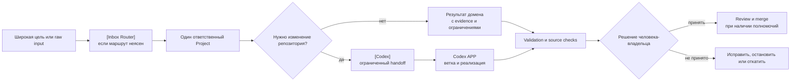
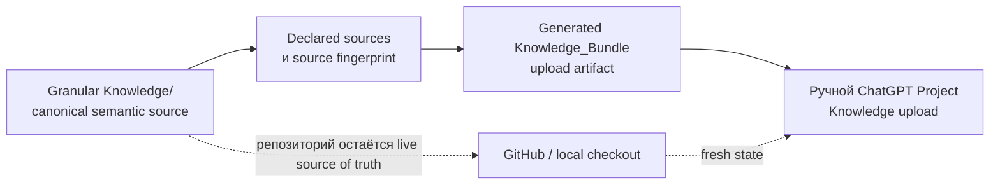

# AI-OS

[English](README.md) | [Русский](README_RU.md)

[](https://github.com/sergstack/AI-OS/actions/workflows/docs-safety.yml)

AI-OS — управляемая операционная система для работы на стыке ChatGPT Projects,
repository delivery, validation и версионируемого Stream Deck-интерфейса. Она
превращает широкую цель в проверяемый путь: определяет одного ответственного
владельца, ограничивает изменение, сохраняет evidence, проверяет результат и
оставляет acceptance и необратимые решения человеку-владельцу.

> **Текущий статус:** candidate / ready for human review. Production promotion
> остаётся запрещённым, пока не пройдены документированные sync, smoke-QA и
> pilot gates. Этот публичный репозиторий **не является open source**; см.
> [rights posture](docs/rights_posture.md).

## Система одним взглядом



Это control loop, а не autonomous agent loop: работа может продолжаться
автоматически только в разрешённом обратимом scope. Acceptance, merge,
production promotion и другие существенные решения остаются решениями человека.

## Что отличает архитектуру

Многие AI-workspace заканчиваются prompt, набором документов или agent loop.
AI-OS делает operational boundaries явными и версионируемыми.

| Проектное решение | Что оно даёт | Чего оно намеренно не утверждает |
|---|---|---|
| **Один ответственный destination** | Семь именованных ChatGPT Project packages разделяют routing, governance, decisions, analytics, LLM quality, implementation и corpus work. | Что один универсальный agent владеет каждым решением. |
| **Две content surfaces** | Granular `Knowledge/` — canonical; compact `Knowledge_Bundles/` — derived upload artifacts с source fingerprints. | Что ChatGPT Project UI всегда синхронен после изменения репозитория. |
| **Goal Mode** | Широкая цель может стать обратимым branch change с checks, risks, rollback и acceptance. | Разрешение расширять scope, merge, deploy или менять защищённые business rules. |
| **Evidence-bearing gates** | Manifests, paths, bundle provenance, instruction length, public-repo safety, smoke QA и pilots являются разными checks. | Что passing test или generated file равен owner acceptance или production readiness. |
| **Human authority** | Review, merge, production promotion и другие существенные действия остаются явными. | Autonomous approval, deployment или persistent production agent platform. |
| **Версионируемые operating surfaces** | ChatGPT packages, Codex APP contracts и Stream Deck artifacts развиваются через Git review и rollback. | Скрытое runtime state вне репозитория. |

Репозиторий можно проверить на каждой границе: куда должна идти задача, какой
source владеет содержанием, какой artifact загружается, что проверено и где
осталось решение владельца.

### Пять связанных механизмов

| Механизм | Какой контроль добавляет | Canonical owner |
|---|---|---|
| **Routing и ownership** | У задачи один primary destination; cross-domain работа использует explicit handoff, а не неявную передачу. | [Routing Rules](ROUTING_RULES.md) и [Project Registry](PROJECT_REGISTRY.md) |
| **Knowledge provenance** | Granular sources владеют смыслом; generated bundles содержат declared source fingerprints для formal upload. | [Sync Contract](SYNC_CONTRACT.md) и project `UPLOAD_LIST.md` |
| **Bounded delivery** | Goal Mode требует smallest useful branch change, relevant checks, rollback и acceptance reporting. | [Goal Mode](GOAL_MODE.md) |
| **Execution traceability** | AES задаёт vocabulary для requirements, validation, defects, corrective action и closure review, не отнимая ownership у Projects. | [AES](docs/standards/AUTONOMOUS_EXECUTION_STANDARD.md) |
| **Evidence и authority** | Repository checks, smoke QA, pilots, external sync, review и production authorization остаются разными состояниями. | [Master Status](MASTER_STATUS.md) и [Current Status](CURRENT_STATUS.md) |

Два ключевых разделения намеренны: generated artifact никогда не становится
semantic owner своего source, а validated result не становится accepted decision
без соответствующей human authority.

### Candidate operational reliability layer

Этот слой документирует четыре candidate contracts, помогающие проверять
operational evidence и failures между запусками. Это только documentation: он
не добавляет runtime service, persistent memory, automatic policy changes или
production workflow. Подробный русский контракт:
[Operational Reliability](docs/OPERATIONAL_RELIABILITY.md).

| Общая механика | Английское название | Русское название |
| --- | --- | --- |
| Жизненный цикл evidence | Evidence lifecycle ledger | Журнал жизненного цикла evidence |
| Намерение запуска | Versioned run intent | Версионированное намерение запуска |
| Наблюдаемость отказов | Typed fault telemetry | Типизированная телеметрия сбоев |
| Превращение сбоя в проверку | Failure-to-regression harness | Контур «сбой → регрессия» |

Точные имена `EvidenceUnit`, `ACTIVE`, `SUPERSEDED`, `REVOKED`, `Candidate
Gate`, `Human Gold`, `fail-closed` и `digest` остаются contract names. Их смысл
можно объяснять по-русски, но нельзя переводить или молча заменять сами имена.
До явного evaluation и owner acceptance этот слой имеет статус `candidate` и
не меняет существующее поведение репозитория.

## Как работает система

```text
goal или raw input
  -> route к одному accountable Project
  -> scope, evidence и constraints
  -> работа в домене или handoff в Codex
  -> validation sources, artifacts и изменённого поведения
  -> human owner review, acceptance, merge или rollback
```

`[Inbox Router]` обрабатывает неясный intake. Routed project сохраняет domain
ownership; `[Codex]` готовит implementation work, а Codex APP меняет
репозиторий в non-`main` branch. Canonical map —
[`ROUTING_RULES.md`](ROUTING_RULES.md), а не этот обзор.

### Семь ChatGPT Projects

| Project | Используйте, когда нужно | Типичный результат |
|---|---|---|
| `[Inbox Router]` | Классифицировать raw request или выбрать destination. | Bounded route или handoff. |
| `[AI OS]` | Governance, AI patterns, evidence, confidence или supported use cases. | Evidence-aware guidance и следующий owner. |
| `[Thinking]` | Options, trade-offs, decisions, risks или Judge/Revisor pass. | Decision memo с assumptions и revisit triggers. |
| `[Analytics]` | Deterministic calculations, data QA, reconciliations, metrics или charts. | Method, calculations, checks и limitations. |
| `[LLM]` | Prompts, model routing, evaluation, quality gates или workflow design. | Governed prompt/workflow proposal и evaluation boundary. |
| `[Codex]` | Implementation framing, code review, tests и release handoff. | Scoped execution package для repository work. |
| `[Thinkers OS]` | Thinker corpus, provenance, synthesis и pattern status. | Source-aware synthesis без выдуманной attribution. |

### Что можно показать снаружи

AI-OS — не просто библиотека prompts. Его ценность можно показать через
связанные рабочие поверхности:

| Поверхность | Что она даёт | Наблюдаемый масштаб |
|---|---|---|
| Семь ChatGPT Projects | Разделяют входящий поток, AI-подходы, решения, аналитику, LLM, разработку и корпус источников. | Явные владельцы, границы и handoff. |
| Analytics Factory | Ведёт от вопроса и data contract до расчёта, memo и QA. | Реестр из **22** аналитических методов. |
| Проверка поведения | Не смешивает consistency репозитория с поведением живого ChatGPT Project. | 99 детерминированных проверок, включая **22** регрессионных кейса; live-каталог — 45 кейсов × 3 запуска. |
| StreamDeck | Делает ежедневные маршруты и безопасные prompts доступными с двух устройств. | 16 переносимых профилей и 140 × 3 model-QA входов. |

22 метода — это не «22 примера ради количества», а словарь способов проверить
вопрос: изменение и структура, data quality и control, проверка объяснений и
взгляд вперёд. Полный реестр с предпосылками, ограничениями и владельцами
проверки находится в
[ANALYTICAL_TECHNIQUES.md](<ChatGPT/[Analytics]/Knowledge/ANALYTICAL_TECHNIQUES.md>).

В текущем репозитории нет вело-кейса: ни данных, ни готового анализа, ни
пользовательского сценария про велосипеды. Поэтому он не должен выглядеть как
уже готовая демонстрация. Такой кейс можно добавить отдельно в `[Analytics]`:
исходные данные → выбранные методы → проверяемые выводы → memo/визуализация.

Authoritative paths, instruction limits и AES applicability находятся в
[project registry](PROJECT_REGISTRY.md). Project packages разделены намеренно:
strategy discussion не должна молча становиться analytics calculation или
repository mutation.

### Canonical sources и upload artifacts



Репозиторий — live source of truth. ChatGPT Project Knowledge — versioned
baseline для bootstrapping и periodic formal sync, а не live replica каждого
commit. Загружайте только bundle files, названные в
`Knowledge_Bundles/UPLOAD_LIST.md`; не загружайте одновременно bundles и их
granular sources, кроме debugging sync issue.

Перед ручным ChatGPT update прочтите [Sync Contract](SYNC_CONTRACT.md) и
[Upload Guide](UPLOAD_GUIDE.md).

### Goal Mode и AES

[Goal Mode](GOAL_MODE.md) — default execution model для широких repository
goals: сначала inspect, затем smallest safe scope, реализация в branch,
relevant checks и report evidence, risks, rollback, acceptance status.

[Autonomous Execution Standard (AES)](docs/standards/AUTONOMOUS_EXECUTION_STANDARD.md)
задаёт shared execution vocabulary для requirements, validation, defects,
corrective action, traceability и closure review. Он не отменяет project
ownership и не разрешает agent одобрять собственную работу. AES applicability
и ограниченное evidence по каждому Project указаны в [registry](PROJECT_REGISTRY.md).

## Начало работы с AI-OS

### 1. Найдите правильную точку входа

| Ваша задача | Начните здесь |
|---|---|
| Понять репозиторий | [Repository map](docs/REPOSITORY_MAP.md) |
| Выбрать ChatGPT Projects или Codex APP для ежедневной работы | [Operating guide](docs/guides/CHATGPT_CODEX_OPERATING_GUIDE.md) |
| Изменить repository content | [`AGENTS.md`](AGENTS.md), затем [Goal Mode](GOAL_MODE.md) |
| Подготовить goal или fixed task | [Goal issue template](.github/ISSUE_TEMPLATE/goal.md) или [Codex task template](.github/ISSUE_TEMPLATE/codex-task.md) |
| Загрузить ChatGPT Project baseline | [Upload Guide](UPLOAD_GUIDE.md) и project `UPLOAD_LIST.md` |
| Проверить evidence, maturity и open gates | [Current status](CURRENT_STATUS.md) и [Master status](MASTER_STATUS.md) |

### 2. Работайте от цели, а не от предполагаемой реализации

Для repository change сформулируйте desired outcome. Goal Mode ограничивает
работу branch, minimal reversible scope, relevant checks, rollback path и
explicit acceptance. Passing test, ready PR или generated artifact не
доказывают, что пользовательский outcome принят.

Для simple local reversible change с достаточным repository context следуйте
applicable local instructions напрямую. Для AI-OS methodology work используйте
canonical routing и bounded-context flow из `AGENTS.md`.

### 3. Проверьте результат перед pull request

В local checkout запустите readiness helper и relevant tests:

```bash
python3 scripts/sync_aios.py
python3 -m pytest tests/ -rA
```

`sync_aios.py` проверяет project-instruction length, public-repository safety,
Goal Mode defaults, manifest paths, Knowledge Bundles и index coverage. Он
**не** загружает данные в ChatGPT, не push-ит в GitHub, не merge-ит PR и не
даёт production approval.

Для contribution и branch requirements используйте
[contributing guide](CONTRIBUTING.md). Точная merge policy находится в
[Goal Mode](GOAL_MODE.md).

## Структура репозитория

| Область | Назначение |
|---|---|
| [`ChatGPT/`](ChatGPT) | Project instructions, canonical granular Knowledge и compact upload bundles. |
| [`Codex APP/`](Codex%20APP) | Local execution contracts, setup, runbooks и review guidance. |
| [`StreamDeck/`](StreamDeck) | Versioned configuration, exports, generators, QA и rollback history. |
| [`docs/`](docs) | Maps, guides, shared standards, operations, evidence и reference material. |
| [`scripts/`](scripts) и [`tests/`](tests) | Deterministic validation и regression coverage. |
| [`.github/`](.github) | Issue intake, PR policy, ownership, security reporting и CI workflows. |

## Evidence и ограничения

AI-OS различает repository consistency и external/operational proof. Passing
checks и bounded candidate evidence не доказывают сами по себе, что каждый
ChatGPT Project синхронизирован, каждый workflow надёжен или разрешён production
promotion.

Candidate status, smoke-QA evidence, pilot boundaries и blocked promotion items
собраны в [Current status](CURRENT_STATUS.md). Точные validation и operational
gates находятся в [Master status](MASTER_STATUS.md).

AI-OS **не** добавляет embeddings, semantic search, vector databases, web UI,
autonomous retrieval, agentic workflows, persistent runtime memory или
production deployments. Public visibility не даёт reuse rights; у репозитория
нет open-source license.

## Полезные ссылки

- [Repository map](docs/REPOSITORY_MAP.md)
- [Project registry](PROJECT_REGISTRY.md)
- [Goal Mode](GOAL_MODE.md)
- [Sync Contract](SYNC_CONTRACT.md)
- [Autonomous Execution Standard](docs/standards/AUTONOMOUS_EXECUTION_STANDARD.md)
- [Current status](CURRENT_STATUS.md)
- [Security policy](.github/SECURITY.md)

## Local path placeholders

В публичной документации используются placeholders вместо machine-specific paths:

- `<LOCAL_AI_OS_ROOT>` — local AI-OS checkout
- `<LOCAL_REPO_ROOT>` — current repository root
- `<LOCAL_CODEX_APP_ROOT>` — local Codex APP folder
- `<LOCAL_ARTIFACTS_ROOT>` — local working artifacts outside the repository
